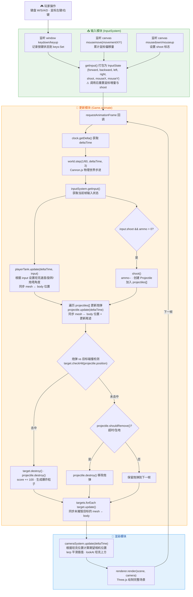
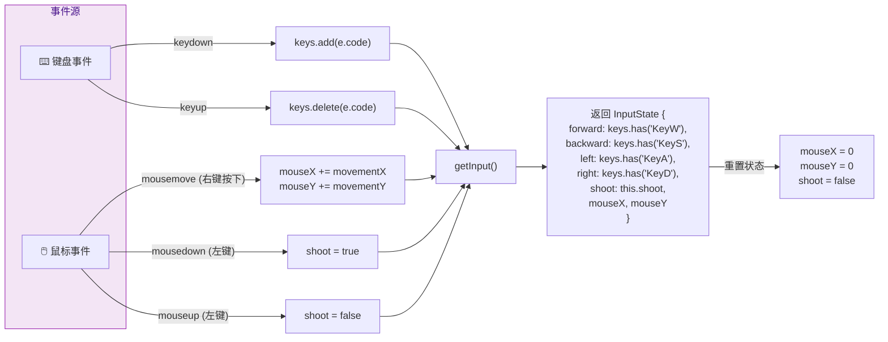
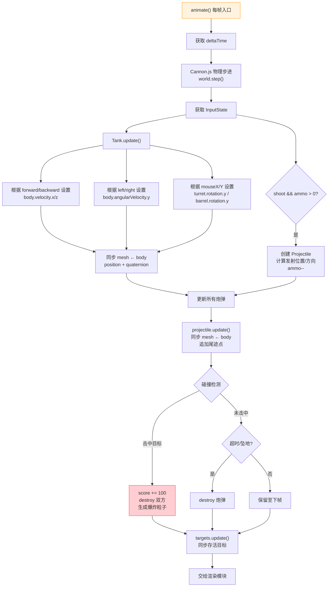
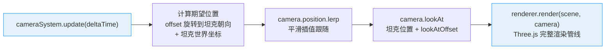
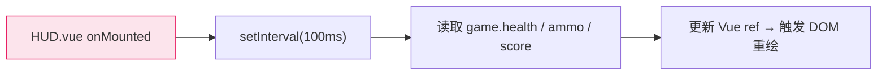

# 玩家操作后 输入→更新→渲染 协作流程

## 一、整体架构概览

项目采用经典的 **游戏主循环 (Game Loop)** 架构，核心调度中心为 `Game.ts` 中的 `animate()` 方法。每一帧依次执行：

```
输入采集 → 物理步进 → 逻辑更新 → 相机更新 → 画面渲染
```

三个核心模块：

| 模块 | 入口类 | 职责 |
|------|--------|------|
| 输入 | `InputSystem` | 监听键盘/鼠标事件，输出 `InputState` |
| 更新 | `Game.animate()` + 各实体 `update()` | 物理步进、坦克移动、炮弹飞行、碰撞检测、状态变更 |
| 渲染 | `THREE.WebGLRenderer` + `CameraSystem` | 相机跟随、Three.js 场景绘制 |

---

## 二、主循环流程图



---

## 三、输入模块详细流程



**关键设计**：`InputSystem` 采用 **增量消费** 模式——`getInput()` 被调用后会重置 `mouseX`、`mouseY` 和 `shoot`，确保每帧只消费一次，避免重复射击或视角漂移。

---

## 四、更新模块详细流程



---

## 五、渲染模块详细流程



---

## 六、HUD 数据同步（独立通道）

HUD (`HUD.vue`) 的数据更新走 **独立的定时器通道**，不参与主循环：



这意味着 HUD 刷新频率约为 **10 FPS**，与游戏主循环（通常 60 FPS）解耦，减少不必要的 Vue 响应式开销。

---

## 七、单帧时序总结

```
┌──────────────────────────────────────────────────────────┐
│                     一帧 (≈16.7ms @60FPS)                │
│                                                          │
│  ① InputSystem.getInput()                                │
│     ↓  返回 InputState + 重置增量                         │
│  ② world.step()                                          │
│     ↓  Cannon.js 物理引擎步进                              │
│  ③ Tank.update(deltaTime, input)                         │
│     ↓  应用移动/旋转 + mesh←body同步                       │
│  ④ 炮弹更新 + 碰撞检测                                     │
│     ↓  击中→加分/销毁  超时→销毁                            │
│  ⑤ Target.update() × N                                   │
│     ↓  mesh←body同步                                      │
│  ⑥ CameraSystem.update(deltaTime)                        │
│     ↓  lerp跟随 + lookAt                                  │
│  ⑦ renderer.render(scene, camera)                        │
│     ↓  GPU绘制                                           │
│  ⑧ requestAnimationFrame → 下一帧                        │
└──────────────────────────────────────────────────────────┘
```

---

## 八、关键源码位置索引

| 关注点 | 文件 | 行号 |
|--------|------|------|
| 主循环调度 | `src/core/Game.ts` | 204-261 |
| 输入事件监听 | `src/systems/InputSystem.ts` | 23-57 |
| 输入状态打包 | `src/systems/InputSystem.ts` | 59-78 |
| 坦克移动/炮塔控制 | `src/entities/Tank.ts` | 110-157 |
| 射击与炮弹创建 | `src/core/Game.ts` | 221-224, 263-272 |
| 碰撞检测 | `src/core/Game.ts` | 231-241 |
| 相机跟随 | `src/systems/CameraSystem.ts` | 22-39 |
| 渲染调用 | `src/core/Game.ts` | 260 |
| HUD 数据轮询 | `src/components/HUD.vue` | 84-91 |
